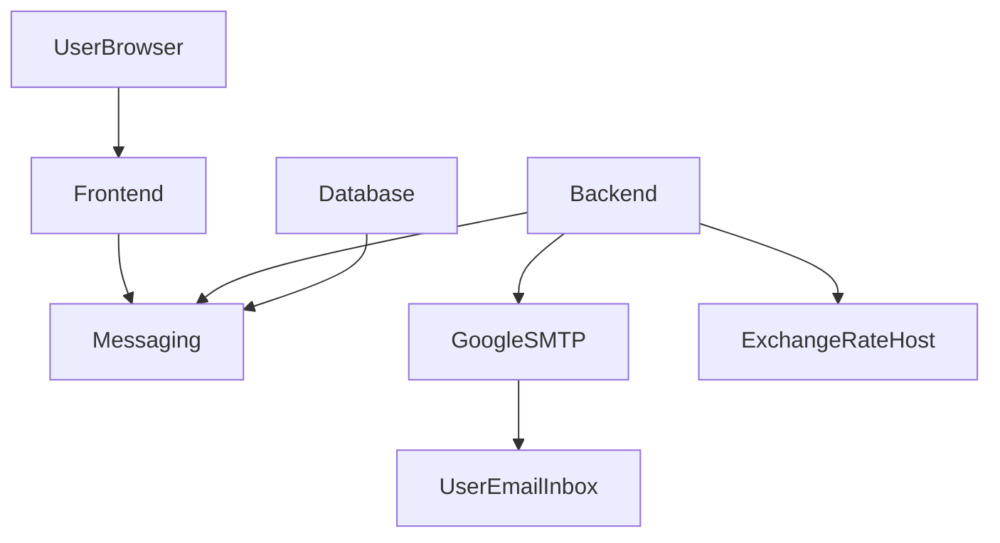

# Currency Ratio Alerter (CRA)
### System Documentation

## Overview
Currency Ratio Alerter is a web application that alerts users when the ratio of a pair of currencies crosses specified treshold. It implements the following capabilities:
1. Users can register by providing their username, password and email address. A verification email is sent, and the user account is not registered until the link in that email is clicked/followed.
2. Users can log in and log out.
3. Logged in users can see their specified alerts (as well as the current ratio of the currencies specified in the alert), they can delete alerts, and they can specify new alerts by
    - selecting two currencies (denoted by the standard currency symbols), and
    - entering a treshold value as a decimal number.
4. Once a day a script is run on the backend that retrieves currency prices from https://exchangerate.host/ (a free to use API), and sends emails for each alert with the threshold value between the ratios of the currency rates from the previous day and today.

## System
The system consists of 4 subsystems:
- frontend,
- backend,
- database, and
- messaging.

All communication between frontend, backend and database is accomplished by sending and receiving messages through the messaging subsystem.

We started by creating Oracle VirtualBox Ubuntu virtual machines on 4 different laptops for each subsystem, but that required all 4 laptops to be on and connected for the system to work. We then switched to cloud virtual machines (AWS EC2 Ubuntu instances) which we could control from our laptops using the AWS Console or SSH. We wrote AWS CLI shell scripts (aws_provision.sh in all 4 top folders in the Git repository) to provision this infrastrructure, as well as shell scripts (aws_ssh.sh) to make it convenient to connect to the EC2 instances from our laptops. We also have a service_composer/service_composer.sh script that connects to each EC2 instance and runs the code for each subsystem in the background. This assumes that the latest code is already on each EC2 instance. (Git repository is cloned into the home folder and `git pull` is performed to get the latest code including the messaging system URL which is updated by messaging/aws_rmq_endpoint.sh script.)

### Frontend
Frontened subsystem is implemented as a Gunicorn WSGI server running `craui` Flask application on port 7007.

### Backend
Backend subsystem consists of two parts:
- `bermq` module that listens to "send_email" and "get_currency_rates" queues, and processes the request messages sent to those queues by connecting to the Google SMTP server and the https://exchangerate.host/ API.
- `process_alerts.py` script which is scheduled using crontab (schedule_process_alerts.sh) to
    - retrieve all users and their alerts from the database,
    - retrieve all relevant currency rates from https://exchangerate.host/ API, and
    - send emails for alerts which are triggered because the ratio of the currency rates crossed the specified threshold.

### Database
Database subsystem consists of two parts:
- MySQL server (which was originally installed and run on the database EC2 instance) cluster managed by AWS RDS. The cluster consists of two instances running in different availability zones (AWS data centers on independednt and redundant power grid and Internet connections, different flood plains, earthquake fault lines, etc.). One of the instances is used for reading and writing to the database, while the other can be used as a read replica. The read replica is automatically promoted to primary (that can be used for both reading and writing to the database) if the primary becomes unavailable for any reason, and AWS RDS will then automatically start another read replica in a new availability zone.
- `dbrmq.py` that listens to "get_user", "get_users", "register_user", "get_alerts", "set_alert", "update_alert" and "delete_alert" queues, and processes the request messages sent to those queues by connecting to the database server above and executing SQL queries/statements. This could also be part of the backend subsystem, but our understanding was that all communication between backend and database should go through the messaging subsystem.

### Messaging
Messaging subsystem is implemented as Amazon MQ RabbitMQ cluster. (It was originally a single RabbitMQ server running on a Ubuntu virtual machine.) The cluster consists of three instances running in different availability zones, and remains available as long as at least one of those instances is available.

## Connection
There are several different connections to consider.

Internally, the subsystems are connected by frontend, backend and database each connecting to the messaging subsystem and sending and receiving messages.

The backend also connects to the the Google SMTP server and the https://exchangerate.host/ API.

The users connect using a browser to the frontend on port 7007.

AWS API can be accessed by using AWS Console, AWS CLI, one of many AWS SDKs, or even by making raw HTTP requests. We have scripted almost everything using AWS CLI, but still rely on AWS Console for some things like rebooting EC2 instances.

We are also connecting to the EC2 instances using SSH and a shared SSH key, and downloading the code to those instances from GitHub over the Internet.

## Flowchart

## Source Code
The source code for the Currency Ratio Alerter (CRA) is available on our GitHub repository. You can access it at the following link:

[Currency Ratio Alerter GitHub Repository](https://github.com/IT340-Group-1/IT490-Project)

The repository is organized into separate folders for each subsystem (frontend, backend, database, and messaging). Within each subsystem folder, you'll find the necessary files, scripts, and configurations to run the respective subsystem. Be sure to read the README.md files in each folder for additional information and setup instructions.

## General Trobleshooting
1. Check the logs: Most issues can be diagnosed by checking the logs for each subsystem. Logs are stored in the `logs/` directory within each subsystem's folder.
2. Verify that all services are running: Ensure that all EC2 instances are running and the messaging subsystem is functioning properly.
3. Confirm proper configuration: Double-check your configuration files and environment variables to ensure they match the expected values.

## Glossary
- CRA: Currency Ratio Alerter, the web application that monitors currency ratios and sends alerts.
- API: Application Programming Interface, a set of rules that allow different software applications to communicate with each other.
- AWS: Amazon Web Services, a cloud computing platform that provides various services like EC2, RDS, and messaging.
- EC2: Amazon Elastic Compute Cloud, a web service that provides resizable compute capacity in the cloud.
- RDS: Amazon Relational Database Service, a web service that makes it easier to set up, operate, and scale a relational database in the cloud.
- RabbitMQ: An open-source message broker that implements the Advanced Message Queuing Protocol (AMQP).
- Gunicorn: A Python Web Server Gateway Interface (WSGI) HTTP server, used to serve the frontend CRA application.
- WSGI: Web Server Gateway Interface, a standard interface between web servers and Python web applications or frameworks.
- SMTP: Simple Mail Transfer Protocol, a communication protocol used for sending email messages over the internet.
- SSH: Secure Shell, a cryptographic network protocol used for secure communication over an unsecured network.
- SQL: Structured Query Language, a programming language used to communicate with and manipulate databases.
- Crontab: A Unix-based utility that allows you to schedule tasks to run automatically at specified intervals.

## Architecture Improvements
If we were designing a system like this outside of a college course, we would rely on [AWS Serverless](https://aws.amazon.com/serverless/) architecture, and used services like SQS instead of RabbitMQ, Lambda instead of EC2, and DynamoDB instead of MySQL. This would make the system almost infinitely (and effortlessly) scalable both up (if we had millions of users) and down (to $0 if we had no users). We would also use [AWS CDK](https://aws.amazon.com/cdk/) instead of AWS CLI.
